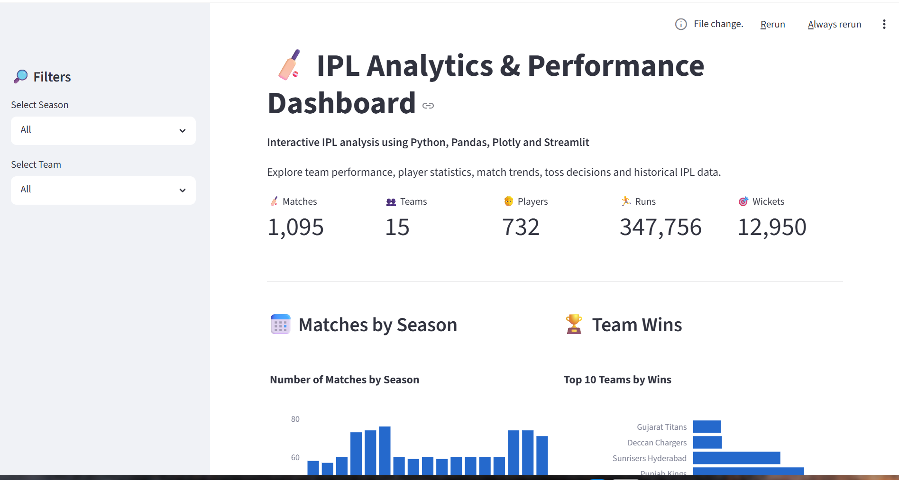

# 🏏 IPL Data Analysis & Analytics Dashboard (2008–2024)


An end-to-end **IPL Data Analysis and Interactive Analytics Dashboard** project covering 17 seasons of IPL data from **2008 to 2024**.

The project combines data cleaning, exploratory data analysis, player performance analysis, statistical insights, and an interactive **Streamlit + Plotly dashboard**.

---

## 📊 Project Overview

This project analyzes IPL match-level and ball-by-ball data to identify trends in:

* 🏏 Player performance
* 🏆 Team performance
* 📈 Season-wise match trends
* 🎯 Bowling and wicket statistics
* 🪙 Toss decisions and match outcomes
* 👤 Individual player performance
* 📊 Historical IPL statistics

The project follows an end-to-end data analytics workflow:

**Raw Data → Data Cleaning → EDA → Statistical Analysis → Visualization → Interactive Dashboard**

---

## 🚀 Interactive IPL Dashboard

The project includes an interactive dashboard built using **Streamlit, Pandas and Plotly**.

### Dashboard Features

* 📌 KPI cards for matches, teams, players, runs and wickets
* 📅 Season-wise match analysis
* 🏆 Team win analysis
* 🏏 Top run scorers
* 🎯 Top wicket takers
* 🪙 Toss decision analysis
* 🔄 Toss winner vs match winner analysis
* 👤 Individual player performance
* 💡 Automatic key insights
* 🔎 Season and team filtering
* 📋 Data preview

### Dashboard Preview

Add your dashboard screenshot here:

```text
Dashboard.png
```

You can place the screenshot in the repository and display it using:

```markdown

```

---

## 📁 Dataset

| Metric     |     Value |
| ---------- | --------: |
| Matches    |     1,095 |
| Seasons    |        17 |
| Deliveries |   260,920 |
| Period     | 2008–2024 |

**Source:** IPL Complete Dataset (2008–2024), Kaggle

> Raw CSV files are not included in the repository. Download the dataset from Kaggle and place the required files inside `data/raw/`.

---

## 🗂️ Repository Structure

```text
ipl-data-analysis/
│
├── data/
│   ├── raw/
│   │   └── matches.csv
│   │   └── deliveries.csv
│   │
│   └── processed/
│       ├── matches_c.csv
│       └── deliveries_c.csv
│
├── notebooks/
│   ├── 01_data_cleaning.ipynb
│   ├── 02_merge_datasets.ipynb
│   └── 03_player_performance_analysis.ipynb
│
├── ipl-data-analysis/
│   ├── Dashboard.py
│   │
│   └── src/
│       ├── data_cleaning.py
│       └── player_stats.py
│
├── reports/
│   └── figures/
│
├── requirements.txt
├── LICENSE
└── README.md
```

---

## 🧹 Data Cleaning

The project handles several real-world data quality issues found in the IPL dataset.

### Cleaning Performed

* Standardized renamed IPL franchises
* Normalized team names
* Standardized venue/stadium names
* Converted date columns to datetime
* Handled missing values
* Cleaned match-level data
* Cleaned ball-by-ball delivery data
* Prepared analysis-ready processed datasets

Examples of standardized teams include:

* Delhi Daredevils → Delhi Capitals
* Kings XI Punjab → Punjab Kings
* Royal Challengers Bangalore → Royal Challengers Bengaluru
* Rising Pune Supergiant / Rising Pune Supergiants → standardized naming

---

## 📓 Notebooks

| Notebook                               | Purpose                                       |
| -------------------------------------- | --------------------------------------------- |
| `01_data_cleaning.ipynb`               | Exploratory analysis and data cleaning        |
| `02_merge_datasets.ipynb`              | Combines match and delivery datasets          |
| `03_player_performance_analysis.ipynb` | Player statistics, scoring and visualizations |

---

## 📈 Player Performance Analysis

The project includes player-level analysis for:

### 🏏 Batting

* Total runs
* Strike rate
* Player rankings

### 🎯 Bowling

* Wickets
* Economy
* Overs bowled
* Player rankings

### 🔄 All-Round Performance

Batting and bowling statistics are combined to create an overall player-performance analysis.

The scoring methodology uses normalized statistics so that different performance metrics can be compared on a common scale.

---

## 📊 Dashboard Analysis

The Streamlit dashboard provides interactive analysis of:

### Season Analysis

Understand how the number of IPL matches changed across seasons.

### Team Performance

Compare team wins across the selected dataset.

### Batting Performance

Identify players with the highest total runs.

### Bowling Performance

Analyze players with the highest wicket counts.

### Toss Analysis

Analyze whether teams generally chose to bat or field after winning the toss.

### Toss vs Match Outcome

Explore the relationship between winning the toss and winning the match.

### Player Performance

Select individual players and analyze their batting statistics.

---

## 💡 Key Insights

The dashboard automatically generates insights based on the selected filters.

Examples include:

* Most successful team in the selected dataset
* Highest run scorer
* Highest wicket taker
* Most common toss decision

This makes the dashboard useful for quickly exploring historical IPL trends.

---

## 🛠️ Tech Stack

### Programming

* Python

### Data Analysis

* Pandas
* NumPy

### Data Visualization

* Matplotlib
* Seaborn
* Plotly

### Dashboard

* Streamlit

### Development

* Jupyter Notebook
* VS Code
* Git & GitHub

---

## ⚙️ Setup & Installation

Clone the repository:

```bash
git clone https://github.com/kartikeypatel2017-png/IPL-Data-Analysis.git
```

Move into the project directory:

```bash
cd IPL-Data-Analysis
```

Install the required Python packages:

```bash
pip install -r requirements.txt
```

---

## ▶️ Run the Interactive Dashboard

From the project root:

```bash
cd ipl-data-analysis
```

Run Streamlit:

```bash
python -m streamlit run Dashboard.py
```

The dashboard will open in your browser.

---

## 📌 Key Skills Demonstrated

This project demonstrates practical experience in:

* Python Programming
* Data Cleaning
* Exploratory Data Analysis
* Pandas
* NumPy
* Data Visualization
* Plotly
* Streamlit
* Statistical Analysis
* Feature Engineering
* Player Performance Analysis
* Dashboard Development
* Git & GitHub

---

## 🔮 Future Improvements

Possible future enhancements include:

* Advanced player comparison
* Venue-wise performance analysis
* Batting vs bowling comparison
* Team head-to-head analysis
* Powerplay / middle-over / death-over analysis
* Season-wise run-rate trends
* Interactive player comparison charts
* Advanced predictive analytics
* Deployment of the Streamlit dashboard

---

## 👨‍💻 Author

**Kartikey Patel**

Data Science & Analytics Enthusiast

Interested in:

**Data Analytics · Data Science · Python · SQL · Power BI · Machine Learning · AI/ML**

---

⭐ If you find this project useful, consider giving the repository a star.

